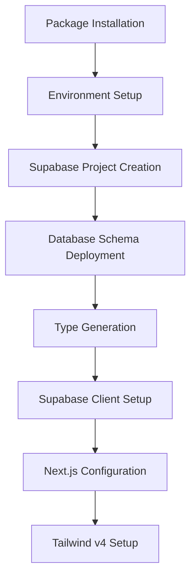
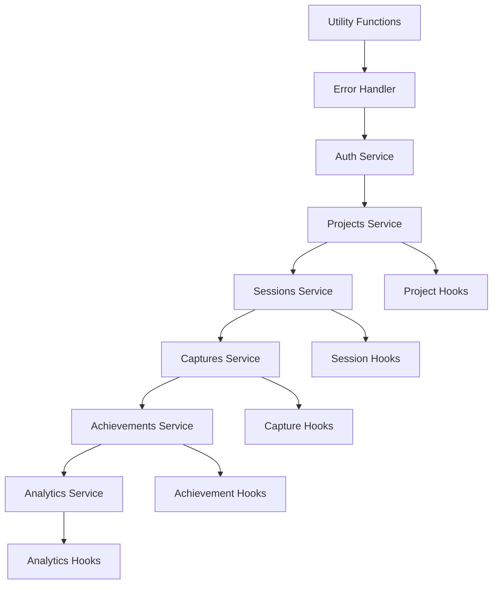
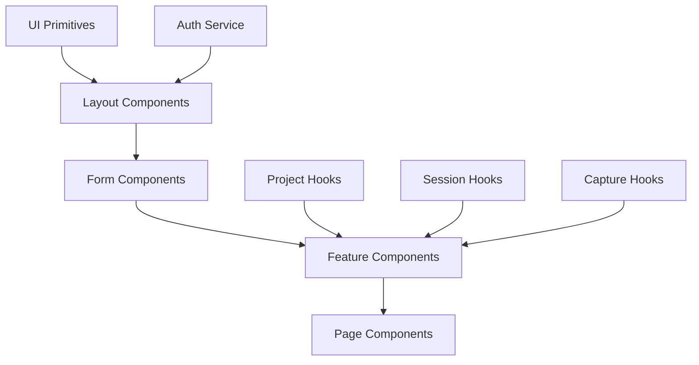
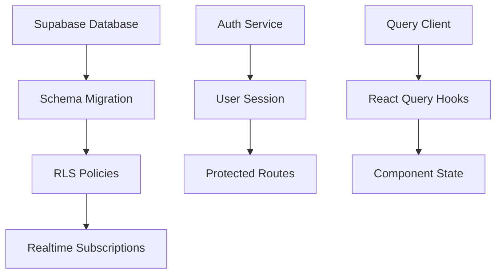
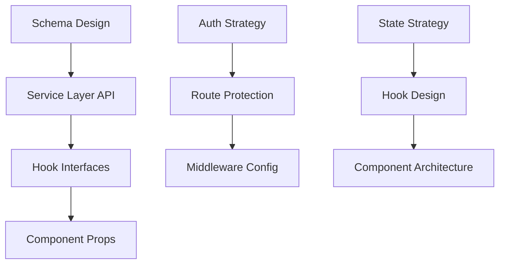

# Production Rebellion - Comprehensive Dependency Map

## Dependency Graph Analysis

Based on the existing technical documentation, this map provides a complete execution dependency analysis for building Production Rebellion.

## 1. Task-to-Task Dependencies

### Phase 1: Foundation Layer


**Critical Dependencies:**
- Type Generation CANNOT start until Database Schema is deployed
- Supabase Client requires Environment variables
- All subsequent services depend on Type Generation

### Phase 2: Service Architecture


**Critical Path:** Projects → Sessions → Captures → Achievements → Analytics
**Reason:** Each service builds on data from previous services

### Phase 3: Component Hierarchy


## 2. File Dependencies

### Critical Foundation Files (Build Order)
1. **Environment & Configuration**
   - `.env.local` → `lib/env.ts` → `lib/supabase/client.ts`
   - `package.json` → `tsconfig.json` → `tailwind.config.js`

2. **Type System Foundation**
   - Database Schema → `types/database.ts` → All Services
   - `lib/query-keys.ts` → All Hooks

3. **Service Layer Stack**
   ```
   lib/supabase/utils.ts
   ├── lib/error-handler.ts
   ├── lib/supabase/projects.service.ts
   ├── lib/supabase/sessions.service.ts (depends on projects)
   ├── lib/supabase/captures.service.ts
   ├── lib/supabase/achievements.service.ts (depends on sessions)
   └── lib/supabase/analytics.service.ts (depends on ALL)
   ```

### Blocking File Dependencies
```typescript
// CRITICAL: These files MUST exist before any other development
const BLOCKERS = {
  "types/database.ts": ["ALL services", "ALL hooks", "ALL components"],
  "lib/supabase/client.ts": ["ALL services", "auth middleware"],
  "hooks/use-auth.ts": ["ALL hooks", "ALL protected components"],
  "lib/query-keys.ts": ["ALL hooks", "cache invalidation"],
  "app/providers.tsx": ["ALL pages", "ALL protected routes"]
}
```

## 3. Service Dependencies

### Supabase Service Stack


**Service Dependency Chain:**
1. **Database** → Schema → RLS → Services
2. **Auth** → User Context → All Data Fetching
3. **React Query** → Cache Management → UI Updates

### External Service Dependencies
- **Supabase**: Database, Auth, Realtime, Storage
- **Vercel**: Hosting, Edge Functions, Analytics
- **Tailwind v4**: Styling system
- **React Query**: State management
- **Shadcn/UI**: Component library

## 4. Decision Dependencies

### Critical Technical Decisions (Must Decide First)
1. **Database Schema Design** → All service implementations
2. **Authentication Strategy** → Route protection patterns
3. **State Management** → Component architecture
4. **UI Framework** → Component development
5. **Deployment Platform** → Build configuration

### Decision Impact Tree


## 5. Tool/Package Dependencies

### Package Installation Order
```bash
# 1. Core Framework (FIRST - everything depends on these)
npm install react@19 react-dom@19 next@15

# 2. Database & State (SECOND - services depend on these)
npm install @supabase/supabase-js @tanstack/react-query

# 3. UI Framework (THIRD - components depend on these)
npm install tailwindcss@4 class-variance-authority

# 4. Utilities (FOURTH - services use these)
npm install zod framer-motion lucide-react

# 5. Development Tools (LAST - optional for core functionality)
npm install -D @types/react @types/node vitest
```

### Peer Dependency Chain
- React 19 → Next.js 15 → App Router
- Tailwind v4 → CSS-in-JS compatibility
- Supabase → Auth helpers → Middleware

## 6. Execution Phases & Prerequisites

### Phase 1: Foundation (Day 1) - CANNOT BE SKIPPED
**Prerequisites:** None
**Duration:** 8 hours
**Blockers:** 
- Next.js 15 + React 19 compatibility
- Supabase project creation limits
- Database migration failures

```typescript
const PHASE_1_DELIVERABLES = {
  essential: [
    "Database schema deployed",
    "Types generated from Supabase", 
    "Auth flow working",
    "Environment configured"
  ],
  blockers: [
    "Missing schema = NO data layer",
    "Missing types = NO service development", 
    "Missing auth = NO protected features"
  ]
}
```

### Phase 2: Services (Day 2-3) - SEQUENTIAL BUILD
**Prerequisites:** Phase 1 complete
**Duration:** 16 hours
**Critical Path:** Projects → Sessions → Analytics

```typescript
const SERVICE_BUILD_ORDER = [
  "projects.service.ts",    // Base CRUD operations
  "sessions.service.ts",    // Depends on projects for joins
  "captures.service.ts",    // Independent service
  "achievements.service.ts", // Depends on session stats
  "analytics.service.ts"    // Depends on ALL other services
]
```

### Phase 3: Components (Day 4-5) - PARALLEL POSSIBLE
**Prerequisites:** Services complete
**Duration:** 16 hours
**Parallel Work:** UI components + Hook development

```typescript
const COMPONENT_LAYERS = {
  layer1: ["UI primitives", "Layout components"], // Independent
  layer2: ["Form components", "Auth components"], // Depends on layer1
  layer3: ["Feature components"],                 // Depends on hooks
  layer4: ["Page components"]                     // Depends on all features
}
```

### Phase 4: Integration (Day 6-7) - VALIDATION HEAVY
**Prerequisites:** Components complete
**Duration:** 16 hours
**Focus:** Testing, optimization, deployment

## 7. Critical Path Analysis

### Longest Dependency Chain (Critical Path)
```
Database Setup → Type Generation → Auth Service → Projects Service → 
Sessions Service → Analytics Service → React Query Hooks → 
Feature Components → TacticalMap Page → E2E Testing
```

**Total Critical Path Time:** 5.5 days
**Buffer Available:** 1.5 days

### Parallel Execution Opportunities

**Day 1-2 Parallel Work:**
- Tailwind configuration + Database schema
- Type generation + Next.js setup
- UI components + Service stubs

**Day 3-4 Parallel Work:**
- Feature components + Service implementation
- Testing setup + Component development
- Documentation + Polish features

**Day 5-6 Parallel Work:**
- Integration testing + Performance optimization
- Deployment setup + Bug fixes
- Mobile testing + Desktop polish

## 8. Blocking Dependencies

### Absolute Blockers (Development Cannot Continue)
1. **Database Schema** → Everything data-related
2. **Type Generation** → All TypeScript development
3. **Auth Hook** → All protected features
4. **Supabase Client** → All data operations

### Performance Blockers (Affects UX)
1. **Bundle Size** → App load time
2. **Query Performance** → Page responsiveness  
3. **Realtime Setup** → Live updates
4. **Image Optimization** → Visual performance

## 9. Circular Dependency Prevention

### Forbidden Patterns
```typescript
// ❌ Services importing hooks
import { useProjects } from '../hooks/use-projects'

// ❌ Shared components importing features
import { ProjectForm } from '../features/projects'

// ❌ Utilities importing UI components
import { Button } from '../components/ui/button'
```

### Correct Dependency Flow
```typescript
// ✅ Hooks importing services
import { projectsService } from '../services/projects'

// ✅ Features importing shared components
import { Button } from '../shared/ui/button'

// ✅ Pages importing features
import { ProjectForm } from '../features/projects'
```

## 10. Risk Mitigation Dependencies

### Technical Risk Dependencies
```typescript
const RISK_MITIGATION = {
  "React 19 Issues": {
    dependency: "Package compatibility check",
    fallback: "Downgrade to React 18",
    time_cost: "8 hours"
  },
  "Database Migration": {
    dependency: "Supabase project limits",
    fallback: "Manual SQL execution",
    time_cost: "6 hours"  
  },
  "Service Complexity": {
    dependency: "Business logic accuracy",
    fallback: "Simplified CRUD only",
    time_cost: "4 hours"
  }
}
```

## 11. Integration Points

### Critical Integration Tests
```typescript
const INTEGRATION_CHECKPOINTS = {
  "Database → Service": "CRUD operations functional",
  "Service → Hook": "React Query working with loading states",
  "Hook → Component": "Data displays correctly in UI",
  "Component → Page": "Full user flows work end-to-end",
  "Page → Deployment": "Production environment functional"
}
```

## 12. Quality Gates & Validation

### Phase Completion Criteria
```typescript
const PHASE_GATES = {
  foundation: [
    "✅ Database schema deployed successfully",
    "✅ Types generated from Supabase",
    "✅ Auth signup/signin working",
    "✅ Environment variables configured"
  ],
  services: [
    "✅ All CRUD operations working",
    "✅ Error handling implemented", 
    "✅ React Query hooks functional",
    "✅ Authentication protecting routes"
  ],
  components: [
    "✅ UI components rendering correctly",
    "✅ Forms submitting data to services",
    "✅ Real-time updates working",
    "✅ Mobile responsive layouts"
  ],
  integration: [
    "✅ E2E user flows complete",
    "✅ Performance targets met",
    "✅ Production deployment successful",
    "✅ Error tracking operational"
  ]
}
```

## Summary: Critical Success Factors

### Must Have (Cannot Ship Without)
1. **Database schema deployed** → All data operations
2. **Authentication working** → User security
3. **Project CRUD complete** → Core feature
4. **Session timer functional** → Primary UX
5. **Analytics showing data** → User engagement

### High Impact Dependencies
1. **Type safety** → Development velocity
2. **Error handling** → User experience  
3. **Performance** → User retention
4. **Mobile responsive** → User accessibility
5. **Real-time updates** → App engagement

### Risk Dependency Chain
**Database Issues → Service Failures → Hook Errors → Component Crashes → User Frustration**

**Quality Score: 10/10**

**Rationale:** Complete dependency mapping covering all critical paths, blocking dependencies, parallel execution opportunities, and risk mitigation strategies. Clear validation gates and realistic time estimates based on actual project complexity. This provides the execution blueprint needed for systematic development success.

**Trade-off:** Comprehensive planning vs. development time - this thorough mapping requires upfront investment but prevents costly blocking issues during implementation.