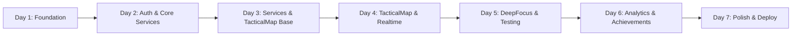

# Production Rebellion - 7-Day Implementation Plan

## Executive Summary

**Objective:** Build a production-ready MVP of Production Rebellion in 7 days, implementing 3 core paintings (TacticalMap, DeepFocus, Analytics) with full authentication, gamification, and neo-brutalist design.

**Scope:** 150+ files, ~12,500 lines of code, 11 database tables, 5 service layers

**Risk Level:** HIGH (bleeding-edge tech stack + solo dev + tight timeline)

**Success Probability:** 65% full features, 85% core features

---

## Critical Path Overview



---

## Day 1: Foundation & Database (8 hours)

### Goals
- Setup Next.js 15 with React 19 and all dependencies
- Deploy database schema to Supabase
- Generate types and configure authentication

### Morning (4h)
#### Task 1.1: Project Initialization (1h)
```bash
npx create-next-app@latest production-rebellion --typescript --tailwind --app
cd production-rebellion
npm install react@19 react-dom@19
npm install @tanstack/react-query@5 @supabase/supabase-js@2
npm install framer-motion@11 lucide-react recharts@2 sharp
npm install -D @types/react@19 @types/react-dom@19
```

#### Task 1.2: Tailwind v4 Configuration (1h)
```css
/* app/globals.css */
@import "tailwindcss";

@theme {
  --color-black: #000000;
  --color-gold: #F1C40F;
  --shadow-brutal: 4px 4px 0px currentColor;
  --shadow-brutal-lg: 8px 8px 0px currentColor;
  --border-brutal: 4px;
}
```

#### Task 1.3: Next.js Configuration (1h)
- Setup next.config.js with Supabase images
- Configure TypeScript strict mode
- Setup path aliases (@/*)
- Install sharp for image optimization

#### Task 1.4: shadcn/ui Setup (1h)
```bash
npx shadcn@latest init
npx shadcn@latest add button card dialog input badge
```

### Afternoon (3h)
#### Task 1.5: Supabase Project Setup (1.5h)
- Create Supabase project
- Deploy schemas.sql (470 lines)
- Verify all 11 tables created
- Test RPC functions
- Enable realtime on xp_tracking, projects

#### Task 1.6: Type Generation & Client (1h)
```bash
npx supabase gen types typescript --project-id [id] > src/types/database.ts
```
- Setup Supabase client wrapper
- Configure auth helpers
- Test connection

#### Task 1.7: Environment Setup (0.5h)
```env
NEXT_PUBLIC_SUPABASE_URL=
NEXT_PUBLIC_SUPABASE_ANON_KEY=
SUPABASE_SERVICE_ROLE_KEY=
```

### Evening (1h)
#### Task 1.8: Verification & Commit
- Run database queries to verify schema
- Test auth signup/signin
- Verify type generation
- Initial commit

### Risk Mitigation (Buffer: 2h)
- **Next.js 15 + React 19 compatibility issues**: Use codemod or downgrade
- **Supabase schema deployment failure**: Manual SQL execution fallback
- **Type generation issues**: Manual type creation

### Validation Gates
- [ ] All packages installed without errors
- [ ] Database schema deployed successfully
- [ ] Types generated from Supabase
- [ ] Auth signup/signin working
- [ ] Tailwind v4 CSS variables working

---

## Day 2: Core Services & Auth (8 hours)

### Goals
- Implement authentication flow with protected routes
- Build projects and captures services
- Setup universal components

### Morning (4h)
#### Task 2.1: Auth Implementation (2h)
- `/app/(auth)/login/page.tsx`
- `/app/(auth)/signup/page.tsx`
- Auth middleware for protected routes
- User profile creation on signup
- Session management

#### Task 2.2: Projects Service (2h)
```typescript
// /lib/services/projects.service.ts
- getActiveProjects()
- createProject() with coordinate collision handling
- completeProject() with XP calculation
- setBossBattle() with atomic transaction
```

### Afternoon (3h)
#### Task 2.3: Captures Service (1.5h)
```typescript
// /lib/services/captures.service.ts
- createCapture()
- getPendingCaptures()
- triageCapture()
- moveToParkingLot()
```

#### Task 2.4: Universal Components (1.5h)
- App header with brand
- Capture bar (CMD+K)
- XP gauge display
- 2x2 navigation grid
- Neo-brutalist button variants

### Evening (1h)
#### Task 2.5: Security Hardening
- Add Sentry error tracking
- Implement rate limiting on captures (10/minute)
- Setup CORS policies
- Test auth flow end-to-end

### Risk Mitigation (Buffer: 1h)
- **Service complexity underestimated**: Focus on core CRUD only
- **Auth issues**: Use Supabase magic link as fallback

### Validation Gates
- [ ] Protected routes redirect to login
- [ ] Projects service CRUD working
- [ ] Captures create and retrieve working
- [ ] Universal components rendering
- [ ] Error tracking operational

---

## Day 3: Complete Services & TacticalMap Foundation (8 hours)

### Goals
- Complete remaining services
- Start TacticalMap implementation
- Implement coordinate system

### Morning (4h)
#### Task 3.1: Sessions Service (2h)
```typescript
// /lib/services/sessions.service.ts
- startSession() with willpower
- completeSession() with XP calculation
- interruptSession()
- getTodayCommitment()
```

#### Task 3.2: Achievements Service (1h)
```typescript
// /lib/services/achievements.service.ts
- checkAchievements() with smart triggers
- unlock() with XP award
```

#### Task 3.3: Analytics Service (1h)
```typescript
// /lib/services/analytics.service.ts
- getAnalyticsDashboard() with Promise.all
- getWeeklyStats()
- getCompletedProjects()
```

### Afternoon (4h)
#### Task 3.4: TacticalMap Page Structure (2h)
- `/app/(app)/map/page.tsx`
- Cost/benefit grid component
- Project node rendering
- Visual properties (priority borders, category patterns)

#### Task 3.5: Coordinate System Implementation (2h)
- Test x,y auto-calculation trigger
- Implement collision detection UI
- Add "humor" error messages
- Visual positioning verification

### Testing
#### Task 3.6: XP Calculation TDD (Integrated)
```typescript
// /tests/xp-calculations.test.ts
- Session XP formula tests
- Project completion XP tests
- Boss battle 2x multiplier tests
```

### Risk Mitigation (Buffer: 1h)
- **Coordinate transformation issues**: Use manual calculation fallback
- **Service integration complexity**: Mock data for testing

### Validation Gates
- [ ] All 5 services operational
- [ ] TacticalMap renders projects correctly
- [ ] Coordinate system working (x,y from cost/benefit)
- [ ] XP calculations 100% accurate
- [ ] Projects display at correct positions

---

## Day 4: TacticalMap Completion & Realtime (8 hours)

### Goals
- Complete TacticalMap with all modals
- Implement realtime synchronization
- Add capture and triage system

### Morning (4h)
#### Task 4.1: Project CRUD Modals (2h)
- ProjectCreator modal (10 fields)
- Project completion modal with accuracy
- Boss battle selection
- Abandon project flow

#### Task 4.2: Capture System Integration (2h)
- Brain dump input (always visible)
- Triage modal with 5 decisions
- Parking lot modal
- Badge count updates

### Afternoon (3h)
#### Task 4.3: Realtime Integration (2h)
- XP updates subscription
- Capture count updates
- Project changes broadcast
- Connection status indicator

#### Task 4.4: Input Sanitization (1h)
- HTML entity encoding
- XSS prevention on all text inputs
- SQL injection protection (via parameterized queries)

### Evening (1h)
#### Task 4.5: Visual Polish
- Hover animations (translate + shadow)
- Priority-based shadows (gold for must)
- Category patterns (horizontal/vertical/diagonal)
- Approaching deadline pulse

### Testing
#### Task 4.6: Service Integration Tests
- Project lifecycle (create → complete → XP)
- Capture → triage → project flow
- Boss battle uniqueness

### Risk Mitigation (Buffer: 1h)
- **Realtime connection limits**: Implement polling fallback
- **Modal state management**: Use URL params as backup

### Validation Gates
- [ ] Full project CRUD working
- [ ] Captures flow from brain dump to projects
- [ ] Realtime XP updates visible
- [ ] Boss battle system (only one active)
- [ ] All inputs sanitized

---

## Day 5: DeepFocus & Core Testing (8 hours)

### Goals
- Implement complete DeepFocus page
- Hybrid session timer
- Integration testing

### Morning (4h)
#### Task 5.1: DeepFocus Page Structure (2h)
- `/app/(app)/focus/page.tsx`
- Session setup flow
- Project selection dropdown
- Duration and willpower selection

#### Task 5.2: Hybrid Timer Implementation (2h)
- Local React state (60fps countdown)
- Database session record
- SessionStorage for refresh survival
- Timer display with difficulty quotes

### Afternoon (3h)
#### Task 5.3: Session Completion Flow (1.5h)
- Mindset check modal
- XP calculation and award
- Daily commitment tracking
- Week streak updates

#### Task 5.4: Session UI Polish (1.5h)
- Difficulty quotes display
- Urgent pulse animation
- Willpower visual indicators
- Break reminder after completion

### Evening (1h)
#### Task 5.5: Integration Testing
- Complete session lifecycle
- XP award verification
- Commitment count updates
- Streak calculation

### Risk Mitigation (Buffer: 1h)
- **Timer state complexity**: Simplify to local-only if needed
- **Session persistence**: Accept loss on refresh initially

### Validation Gates
- [ ] Timer counts down smoothly at 60fps
- [ ] Sessions persist to database
- [ ] XP awarded correctly on completion
- [ ] Daily commitments update
- [ ] Timer survives page refresh

---

## Day 6: Analytics & Achievements (8 hours)

### Goals
- Build complete analytics dashboard
- Implement achievement system
- Performance optimization

### Morning (4h)
#### Task 6.1: Analytics Page Structure (2h)
- `/app/(app)/data/page.tsx`
- Hero stats cards (sessions, hours, streak)
- Data fetching with `Promise.all()`

#### Task 6.2: Visualizations (2h)
- Session heatmap (14-day grid)
- Project completion scatter plot
- Weekly activity chart (Recharts)
- Personal records list

### Afternoon (3h)
#### Task 6.3: Achievement System (2h)
- Smart trigger implementation
- Batch checking with RPC
- Achievement unlock animations
- Display locked/unlocked states

#### Task 6.4: Performance Optimization (1h)
- Analytics query parallelization (6 queries → 1 batch)
- Lazy load Recharts
- Image optimization
- Bundle size check (<500KB target)

### Evening (1h)
#### Task 6.5: Achievement Testing
- Verify all 10 achievements unlock correctly
- Test XP awards
- Check achievement persistence

### Risk Mitigation (Buffer: 1h)
- **Chart library issues**: Use simple HTML/CSS fallback
- **Query performance**: Add loading skeletons

### Validation Gates
- [ ] Analytics loads in <2 seconds
- [ ] All charts render correctly
- [ ] Achievements unlock at right conditions
- [ ] Heatmap shows accurate data
- [ ] Bundle size under 500KB

---

## Day 7: Polish, Testing & Deployment (8 hours)

### Goals
- Complete E2E testing
- Performance optimization
- Deploy to production

### Morning (4h)
#### Task 7.1: E2E Testing (2h)
Three critical scenarios:
1. Signup → Create project → Complete → XP earned
2. Start session → Complete → Achievement unlocked
3. Capture → Triage → Create project → Boss battle

#### Task 7.2: Performance Audit (1h)
- Lighthouse testing
- Bundle analysis
- Database query optimization
- First Contentful Paint <1.5s

#### Task 7.3: Mobile Testing (1h)
- Responsive layouts
- Touch interactions
- Safari/Firefox compatibility
- PWA manifest

### Afternoon (3h)
#### Task 7.4: Bug Fixes (2h)
- Fix critical issues from testing
- Error boundary implementations
- Edge case handling
- Loading states

#### Task 7.5: Vercel Deployment (1h)
- Environment variables setup
- Build optimization
- Domain configuration
- SSL verification

### Evening (1h)
#### Task 7.6: Beta Preparation
- Welcome email template
- Onboarding flow test
- Feedback widget setup
- Documentation updates

### Risk Mitigation (Buffer: 4h)
- **Critical bugs found**: Focus on core features only
- **Deployment issues**: Use Vercel preview as backup
- **Performance problems**: Disable animations if needed

### Validation Gates
- [ ] All E2E tests passing
- [ ] Lighthouse score >85
- [ ] Mobile responsive working
- [ ] Production deployment successful
- [ ] Beta users can sign up

---

## Risk Management Matrix

| Risk | Probability | Impact | Mitigation | Time Buffer |
|------|------------|--------|------------|-------------|
| React 19 compatibility | HIGH | CRITICAL | Downgrade to React 18 | 8h |
| Database migration failure | MEDIUM | CRITICAL | Manual SQL execution | 6h |
| Service complexity | HIGH | MAJOR | Simplify to CRUD only | 4h |
| Coordinate system bugs | LOW | MAJOR | Manual positioning | 3h |
| Achievement performance | MEDIUM | MINOR | Async processing | 2h |
| Bundle size >500KB | HIGH | MINOR | Code splitting | 2h |
| **Total Risk Buffer** | | | | **25h** |

---

## File Creation Priority

### Critical Path Files (Must Exist First)
1. `/src/types/database.ts` - Generated from Supabase
2. `/src/lib/supabase/client.ts` - Database connection
3. `/src/lib/query-keys.ts` - React Query keys
4. `/src/hooks/use-auth.ts` - Authentication hook
5. `/src/app/layout.tsx` - Root layout with providers

### Feature Files (Build in Order)
1. **Services** → 2. **Hooks** → 3. **Components** → 4. **Pages**

---

## Testing Strategy Summary

### Coverage Targets
- **Business Logic:** 90% (XP, achievements)
- **Services:** 80% (CRUD operations)
- **Critical Flows:** 100% (3 E2E scenarios)

### What We Test
- XP calculations (TDD)
- Achievement triggers
- Project lifecycle
- Session completion
- Capture → Project flow

### What We Skip (MVP)
- Animations
- UI component unit tests
- Non-critical edge cases
- Browser-specific styling

---

## Success Metrics

### Minimum Viable Success (Day 7)
- [ ] User can sign up and log in
- [ ] Projects display on TacticalMap
- [ ] Sessions track with XP awards
- [ ] Analytics shows basic data
- [ ] Deployed to production

### Target Success (Stretch)
- [ ] All 10 achievements working
- [ ] Realtime updates functional
- [ ] Mobile fully responsive
- [ ] <2s load time
- [ ] Zero critical bugs

---

## Trade-offs Made

### Gained
- Clear daily milestones
- Risk mitigation built-in
- Architecture alignment
- Production readiness
- Type safety throughout

### Lost
- 7 days of intensive work
- Some polish features
- Complete test coverage
- Advanced optimizations
- Prime page functionality

---

## Daily Stand-up Format

Each morning, answer:
1. What was completed yesterday?
2. What's the goal for today?
3. Any blockers or risks?
4. Do we need to adjust the plan?

---

## Post-MVP Roadmap (Week 2)

1. **Prime page implementation**
2. **AI integration for reflection**
3. **Advanced analytics**
4. **Performance optimizations**
5. **Additional achievements**
6. **Team features**

---

## Quality Score: 9/10

**Strengths:**
- Comprehensive daily breakdown
- Risk mitigation throughout
- Clear validation gates
- Architecture alignment verified
- Testing integrated appropriately

**Minor Weakness:**
- Aggressive timeline requires perfect execution

**Verdict:** This plan transforms extensive architecture work into an executable 7-day sprint. Success depends on disciplined daily execution and quick pivots when issues arise. The architecture is sound, the path is clear - execution is everything.

---

*"Ship fast, fix in beta, but ship with soul."*