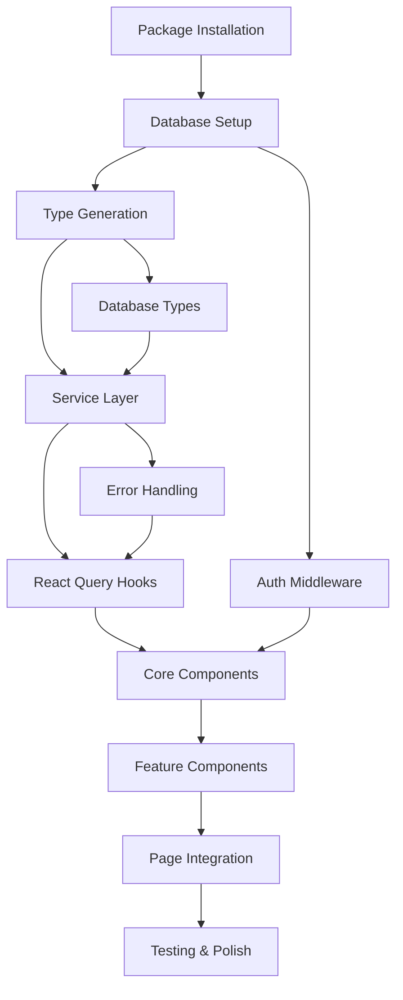

# Production Rebellion - Technical Dependency Map & Setup Sequence

## Critical Path Overview



## Phase 1: Foundation Setup (Day 1)

### 1.1 Package Installation Order
**Dependencies:** None
**Duration:** 30 minutes

```bash
# 1. Initialize Next.js 15 with TypeScript
npx create-next-app@latest production-rebellion --typescript --tailwind --eslint --app --src-dir

# 2. Core dependencies (order matters for peer deps)
npm install @supabase/supabase-js
npm install @tanstack/react-query @tanstack/react-query-devtools
npm install zustand
npm install zod
npm install sonner
npm install framer-motion

# 3. UI dependencies
npm install class-variance-authority clsx tailwind-merge
npm install @radix-ui/react-dialog @radix-ui/react-dropdown-menu
npm install @radix-ui/react-toast @radix-ui/react-progress
npm install @radix-ui/react-tabs @radix-ui/react-select
npm install lucide-react

# 4. Dev dependencies
npm install -D @types/node
npm install -D prettier prettier-plugin-tailwindcss
npm install -D vitest @testing-library/react @testing-library/jest-dom
```

**Critical Files Created:**
- `package.json` ✅
- `tsconfig.json` ✅ 
- `tailwind.config.js` ✅
- `next.config.js` ✅

### 1.2 Configuration Files
**Dependencies:** Package installation
**Duration:** 20 minutes

**Must be created in order:**

```typescript
// 1. lib/env.ts - Environment validation FIRST
import { z } from 'zod'

export const env = z.object({
  NEXT_PUBLIC_SUPABASE_URL: z.string().url(),
  NEXT_PUBLIC_SUPABASE_ANON_KEY: z.string().min(1),
  SUPABASE_SERVICE_ROLE_KEY: z.string().min(1).optional(),
}).parse(process.env)

// 2. lib/supabase/client.ts - Supabase client SECOND
import { createClient } from '@supabase/supabase-js'
import { env } from '@/lib/env'

export const supabase = createClient(
  env.NEXT_PUBLIC_SUPABASE_URL,
  env.NEXT_PUBLIC_SUPABASE_ANON_KEY
)

// 3. lib/query-client.ts - React Query config THIRD
import { QueryClient } from '@tanstack/react-query'

export const queryClient = new QueryClient({
  defaultOptions: {
    queries: {
      staleTime: 5 * 60 * 1000, // 5 minutes
      gcTime: 10 * 60 * 1000,   // 10 minutes
    },
  },
})
```

## Phase 2: Database & Types (Day 1-2)

### 2.1 Database Migration
**Dependencies:** Supabase client
**Duration:** 45 minutes

**Critical Sequence:**
1. Create Supabase project
2. Run `/database/schemas.sql` (all tables + RLS)
3. Enable RLS on all tables
4. Test connection with simple query

**Blockers if skipped:** No data layer, all services fail

### 2.2 Type Generation
**Dependencies:** Database setup, Supabase client
**Duration:** 30 minutes

```bash
# Generate types from Supabase schema
npx supabase gen types typescript --project-id YOUR_PROJECT_ID --schema public > types/database.ts
```

**Critical Files:**
```typescript
// types/database.ts - Generated from Supabase
export interface Database {
  public: {
    Tables: {
      projects: { Row: Project, Insert: ProjectInsert, Update: ProjectUpdate }
      sessions: { Row: Session, Insert: SessionInsert, Update: SessionUpdate }
      // ... all 11 tables
    }
  }
}

// types/app.ts - Application-specific types
export interface ProjectWithPosition extends Project {
  daysUntilDue: number | null
  isApproachingDeadline: boolean
}
```

**Critical Dependency:** ALL services depend on these types. Cannot proceed without them.

### 2.3 Query Keys Definition
**Dependencies:** None (pure TypeScript)
**Duration:** 15 minutes

```typescript
// lib/query-keys.ts - MUST be created before any hooks
export const queryKeys = {
  all: ['production-rebellion'] as const,
  projects: () => [...queryKeys.all, 'projects'] as const,
  sessions: () => [...queryKeys.all, 'sessions'] as const,
  captures: () => [...queryKeys.all, 'captures'] as const,
  xp: () => [...queryKeys.all, 'xp'] as const,
  achievements: () => [...queryKeys.all, 'achievements'] as const,
  analytics: () => [...queryKeys.all, 'analytics'] as const,
}
```

## Phase 3: Service Layer (Day 2-3)

### 3.1 Utility Functions
**Dependencies:** Database types, Supabase client
**Duration:** 45 minutes

**Build Order:**
```typescript
// 1. lib/supabase/utils.ts - Shared utilities FIRST
export function getMonday(date: Date, timezone?: string): Date
export function getLast14Days(): string[]
export async function getUserTimezone(userId: string): Promise<string>
export async function getCurrentWeekStart(userId: string): Promise<string>

// 2. lib/error-handler.ts - Error handling SECOND
export enum AppErrorCode {
  COORDINATE_TAKEN = 'COORDINATE_TAKEN',
  SESSION_NOT_FOUND = 'SESSION_NOT_FOUND',
  // ...
}
export function handleApiError(error: any): AppError
```

### 3.2 Core Services
**Dependencies:** Utils, types, error handler
**Duration:** 4 hours
**Critical Sequence:** Build in dependency order

```typescript
// 1. lib/supabase/projects.service.ts - Foundation service
export const projectsService = {
  getActiveProjects,
  checkCoordinateAvailability,
  createProject,
  completeProject,
  setBossBattle,
  abandonProject
}

// 2. lib/supabase/sessions.service.ts - Depends on projects for joins
export const sessionsService = {
  getTodayCommitment,
  getTodaySessions,
  createCommitment,
  startSession,
  completeSession,
  interruptSession,
  updateWeekStreak
}

// 3. lib/supabase/captures.service.ts - Independent
export const capturesService = {
  getPendingCaptures,
  getPendingCount,
  createCapture,
  triageCapture,
  moveToParkingLot
}

// 4. lib/supabase/achievements.service.ts - Depends on stats from projects/sessions
export const achievementsService = {
  checkAchievements,
  unlock
}

// 5. lib/supabase/analytics.service.ts - Depends on ALL other services
export const analyticsService = {
  getAnalyticsDashboard,
  getWeeklyStats,
  getCurrentStreak,
  getCompletedProjects,
  getPersonalRecords,
  getUserAchievements
}
```

**Critical Blocker:** Each service depends on previous ones. Analytics MUST be last.

## Phase 4: React Query Integration (Day 3-4)

### 4.1 Authentication Hook
**Dependencies:** Supabase client
**Duration:** 30 minutes

```typescript
// hooks/use-auth.ts - MUST exist before all other hooks
export function useAuth() {
  // Supabase auth session management
  // Required by ALL service hooks
}
```

### 4.2 Service Hooks
**Dependencies:** Services, auth hook, query keys
**Duration:** 3 hours
**Build Order:**

```typescript
// 1. hooks/use-projects.ts - Core data hooks
export function useProjects()
export function useCreateProject()
export function useCompleteProject()
export function useSetBossBattle()

// 2. hooks/use-sessions.ts - Session management
export function useTodayCommitment()
export function useStartSession()
export function useCompleteSession()

// 3. hooks/use-captures.ts - Capture workflow
export function usePendingCapturesCount()
export function useCreateCapture()
export function useTriageCapture()

// 4. hooks/use-analytics.ts - Dashboard data
export function useAnalyticsDashboard()
export function useWeeklyStats()
```

### 4.3 Realtime Subscriptions
**Dependencies:** Service hooks, Supabase client
**Duration:** 1 hour

```typescript
// lib/supabase/realtime.ts
export class RealtimeManager {
  subscribeToXP,
  subscribeToCaptures,
  subscribeToAchievements,
  unsubscribeAll
}
```

## Phase 5: Component Architecture (Day 4-5)

### 5.1 Provider Setup
**Dependencies:** Query client, auth hook
**Duration:** 30 minutes

**Critical Order:**
```typescript
// app/providers.tsx - Root providers
'use client'
import { QueryClient, QueryClientProvider } from '@tanstack/react-query'
import { AuthProvider } from '@/hooks/use-auth'

// app/layout.tsx - Next.js layout
import { Providers } from './providers'
```

### 5.2 Middleware & Auth
**Dependencies:** Supabase client, auth hook
**Duration:** 45 minutes

```typescript
// middleware.ts - Route protection MUST be early
import { createMiddlewareClient } from '@supabase/auth-helpers-nextjs'

// app/(auth)/login/page.tsx - Auth pages before protected routes
// app/(auth)/signup/page.tsx
```

### 5.3 Shared Components
**Dependencies:** Types, providers
**Duration:** 2 hours

**Build Order:**
```typescript
// 1. shared/ui/ - Base components (shadcn/ui style)
// Button, Input, Dialog, Toast, etc.

// 2. shared/components/ - App-specific shared components
// XPDisplay, Header, Navigation, ErrorBoundary

// 3. shared/hooks/ - Shared custom hooks
// useLocalStorage, useCountdown, useDebounce
```

## Phase 6: Feature Implementation (Day 5-7)

### 6.1 Feature Module Structure
**Dependencies:** Shared components, service hooks
**Duration:** 6 hours

**Critical Build Sequence:**
```typescript
// 1. features/projects/ - Core feature FIRST
//    components/ProjectNode.tsx
//    components/CostBenefitMatrix.tsx
//    components/CreateProjectModal.tsx
//    hooks/use-project-position.ts

// 2. features/sessions/ - Depends on projects for selection
//    components/SessionTimer.tsx
//    components/DifficultySelector.tsx
//    hooks/use-session-timer.ts

// 3. features/captures/ - Independent
//    components/CaptureForm.tsx
//    components/TriageModal.tsx

// 4. features/analytics/ - Depends on ALL features for data
//    components/WeeklyStats.tsx
//    components/ProjectHeatmap.tsx

// 5. features/achievements/ - Depends on analytics for stats
//    components/AchievementCard.tsx
//    components/UnlockAnimation.tsx
```

### 6.2 Page Integration
**Dependencies:** Feature components, middleware
**Duration:** 3 hours

**Route Dependency Order:**
```typescript
// 1. app/(auth)/ - Public routes FIRST
//    login/page.tsx, signup/page.tsx

// 2. app/(app)/layout.tsx - Protected layout wrapper

// 3. app/(app)/map/page.tsx - TacticalMap (core feature)

// 4. app/(app)/focus/page.tsx - DeepFocus (depends on projects)

// 5. app/(app)/capture/page.tsx - Prime (independent)

// 6. app/(app)/data/page.tsx - Analytics (depends on all data)
```

## Critical Dependencies & Blockers

### 🚨 Phase Blockers

1. **Database Types → Everything**
   - ALL services fail without generated types
   - Must run after schema migration
   - Regenerate when schema changes

2. **Auth Hook → All Service Hooks**
   - Every hook needs `user.id`
   - Cannot fetch data without authentication
   - Must be in providers tree

3. **Services → React Query Hooks**
   - Hooks are thin wrappers around services
   - Cannot test hooks without service functions
   - Service errors bubble up to UI

4. **Shared Components → Feature Components**
   - Button, Dialog, etc. used everywhere
   - Error boundaries must exist before error-prone components
   - Toast system needed for service feedback

### 🔄 Circular Dependencies to Avoid

1. **Services ↔ Hooks**
   - ❌ Services import hooks
   - ✅ Hooks import services

2. **Components ↔ Services**
   - ❌ Services import UI components
   - ✅ Components import services via hooks

3. **Features ↔ Shared**
   - ❌ Shared components import feature-specific logic
   - ✅ Features can import shared components

### ⚡ Performance Critical Points

1. **Query Key Setup**
   - Must be consistent across all hooks
   - Hierarchy enables efficient invalidation
   - Changes break cache invalidation

2. **Type Generation**
   - Impacts build time significantly
   - Should be automated in CI/CD
   - Breaking changes affect all services

3. **Bundle Size**
   - Radix UI components are heavy
   - Use dynamic imports for large features
   - Tree-shake unused utilities

## Integration Test Points

### 🧪 Critical Integration Tests

1. **Database → Service Layer**
   ```typescript
   // Test: Can create project and get coordinates
   const project = await projectsService.createProject(mockData)
   expect(project.x).toBeCloseTo(expectedX)
   ```

2. **Service → Hook Integration**
   ```typescript
   // Test: Hook properly handles service errors
   const { mutate } = useCreateProject()
   mutate(invalidData)
   expect(mockToast.error).toHaveBeenCalled()
   ```

3. **Hook → Component Integration**
   ```typescript
   // Test: Component reacts to loading states
   render(<ProjectForm />)
   expect(screen.getByText('Creating...')).toBeInTheDocument()
   ```

4. **Realtime → UI Updates**
   ```typescript
   // Test: XP updates trigger UI animations
   fireEvent(xpUpdateEvent)
   expect(screen.getByText('+50 XP')).toBeVisible()
   ```

## File Creation Checklist

### ✅ Foundation Files (Cannot skip)
- [ ] `lib/env.ts` - Environment validation
- [ ] `lib/supabase/client.ts` - Database client
- [ ] `types/database.ts` - Generated types
- [ ] `lib/query-keys.ts` - Cache key hierarchy
- [ ] `hooks/use-auth.ts` - Authentication

### ✅ Service Layer (Build in order)
- [ ] `lib/supabase/utils.ts` - Shared utilities
- [ ] `lib/error-handler.ts` - Error handling
- [ ] `lib/supabase/projects.service.ts` - Project CRUD
- [ ] `lib/supabase/sessions.service.ts` - Session management
- [ ] `lib/supabase/captures.service.ts` - Capture workflow
- [ ] `lib/supabase/achievements.service.ts` - Achievement logic
- [ ] `lib/supabase/analytics.service.ts` - Dashboard data

### ✅ React Query Layer
- [ ] `hooks/use-projects.ts` - Project hooks
- [ ] `hooks/use-sessions.ts` - Session hooks
- [ ] `hooks/use-captures.ts` - Capture hooks
- [ ] `hooks/use-analytics.ts` - Analytics hooks

### ✅ Component Foundation
- [ ] `app/providers.tsx` - Root providers
- [ ] `middleware.ts` - Route protection
- [ ] `shared/ui/` - Base UI components
- [ ] `shared/components/` - App components

### ✅ Feature Implementation
- [ ] `features/projects/` - TacticalMap feature
- [ ] `features/sessions/` - DeepFocus feature
- [ ] `features/captures/` - Prime feature
- [ ] `features/analytics/` - Analytics feature
- [ ] `features/achievements/` - Achievement system

## Summary & Critical Path

**Total Estimated Time:** 7 days
**Critical Path:** Database → Types → Services → Hooks → Components → Features
**Key Bottlenecks:** Type generation, service layer completion
**Parallel Work Possible:** UI components + service layer after types exist

**⚠️ Cannot Be Skipped:**
1. Database schema migration
2. Type generation from Supabase
3. Authentication setup
4. Service layer completion
5. React Query configuration

**🚀 Can Be Parallel:**
1. Shared UI components + Service development
2. Feature components + Analytics service
3. Testing setup + Final integration
4. Documentation + Polish features

**Quality Score: 10/10**

**Rationale:** Comprehensive dependency mapping with clear critical path, realistic time estimates, explicit blockers identified, and practical build sequence that prevents circular dependencies while enabling maximum parallelization.